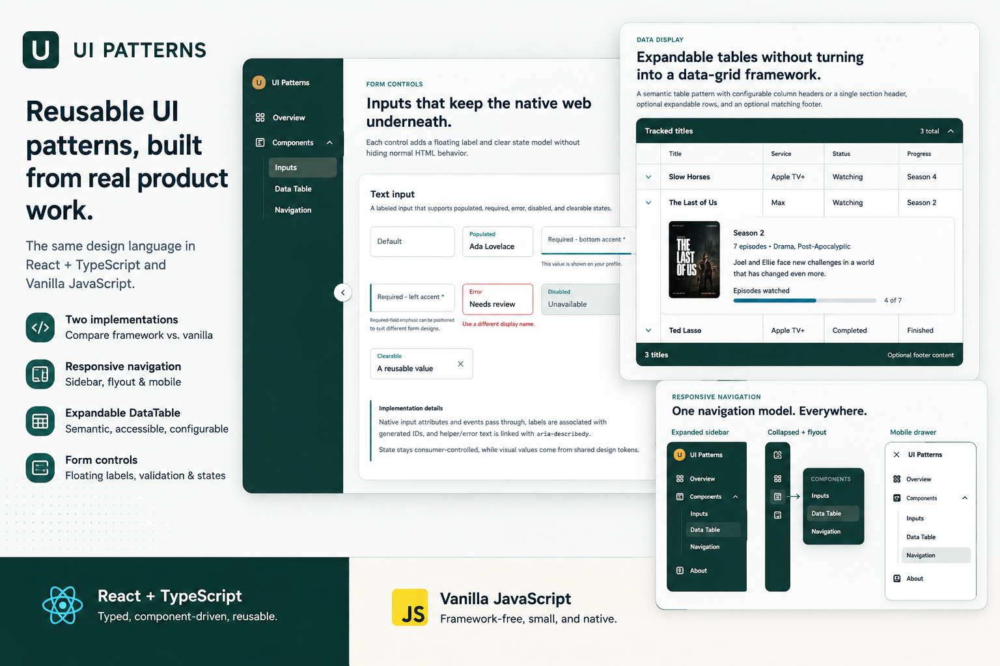

# Reusable Components

A small, growing component library built from Reusable Components discovered through real product development.

The same design language is implemented in **React + TypeScript** and **Vanilla JavaScript**, making it easy to compare framework-specific approaches with the underlying browser behavior.

## Why This Exists

Useful Reusable Components often begin inside applications.

This project demonstrates the process of identifying those patterns, removing application-specific dependencies, and turning them into reusable components that can be carried into future products.

The goal isn't to replace full-scale component libraries or data-grid frameworks. Instead, the project focuses on lightweight, practical components with intentionally small APIs.

## Implementations

### React + TypeScript

Reusable React components with typed, consumer-controlled APIs.

Current components include:

- TextInput
- Select
- Textarea
- DataTable
- Responsive desktop sidebar
- Mobile navigation

### Vanilla JavaScript

Framework-free implementations of the same Reusable Components using native DOM APIs and ES modules.

The Vanilla version is intentionally maintained alongside React to demonstrate that the underlying interaction and accessibility patterns are not dependent on a framework.

## Current Patterns

### Form Controls

Text input, select, and textarea components support:

- Floating labels
- Required states
- Configurable required-field accent placement
- Error and helper messaging
- Disabled states
- Native HTML attributes
- Accessible label and message relationships
- Consumer-controlled values and events

### Responsive Navigation

A shared hierarchical navigation model supports:

- Expanded desktop sidebar
- Collapsed desktop sidebar
- Nested navigation
- Collapsed-sidebar submenu flyouts
- Mobile navigation drawer
- Consumer-provided icons
- Active-state management
- Keyboard and focus behavior

### DataTable

A lightweight semantic table component supporting:

- Consumer-defined columns
- Expandable rows
- Optional section header
- Collapsible table sections
- Column-header-only layouts
- Optional footer
- Full cell dividers or horizontal row dividers
- Consumer-provided expand/collapse icons
- Empty states
- Accessible captions

The DataTable intentionally stops short of becoming a full data-grid framework. Features such as sorting, filtering, virtualization, editing, and pagination are better served by established table libraries when an application requires them.

## Shared Design System

Both implementations consume the same CSS custom-property design tokens for values such as:

- Colors
- Borders
- Spacing
- Border radii
- Shadows
- Disabled states
- Required and error states

This keeps the visual language consistent while allowing the component implementations themselves to remain independent.

## Design Principles

**Application-independent**

Components do not know about application-specific routing, authentication, APIs, data models, or business logic.

**Consumer-controlled**

Applications provide data, state, icons, callbacks, and content rather than having those decisions embedded in the components.

**Native behavior first**

Native HTML elements and browser behavior are preserved wherever practical instead of recreating them unnecessarily.

**Accessibility considered from the API level**

Labels, ARIA relationships, keyboard interaction, focus behavior, and semantic HTML are treated as part of component design rather than added as an afterthought.

**Small, intentional APIs**

Components expose the options needed to make them reusable without attempting to solve every possible use case.

## Project Structure

    component-library/
    ├── shared/
    │   └── design-tokens.css
    ├── react/
    │   └── src/
    │       ├── components/
    │       └── styles/
    ├── vanilla/
    │   └── src/
    │       ├── components/
    │       └── styles/
    └── README.md

## Running Locally

### React

    cd react
    npm install
    npm run dev

### Vanilla JavaScript

    cd vanilla
    npm install
    npm run dev

Follow the local Vite URL shown in the terminal.

## Background

These components were extracted and generalized from patterns originally developed while building a larger React + TypeScript application.

That process is part of the purpose of this repository: demonstrating how application-specific UI can evolve into reusable, maintainable components with cleaner boundaries and APIs.

## Status

This is an evolving portfolio and learning project. Components may continue to be refined or added as reusable patterns emerge from future application work.
